<!-- index.md -->

<!-- # About -->

  
[Bilibili](https://space.bilibili.com/515553532) | [Steam](https://steamcommunity.com/profiles/76561199677607305/) | [Gitee](https://gitee.com/Pfolg) | [GitHub (csy214)](https://github.com/csy214-beep) | [GitHub (pfolg)](https://github.com/pfolg)

- In SiChuan, PRC. Student
- A rookie
- Basic use of Python, Master a little Cpp, R, Fortran, C#, Dart, Live2D, Linux and basic frontend development
- Able to use AI chat proficiently
- Hobbies
  - Playing games
  - Creating something

  
  _于二进制潮汐涨落之间求索_
  

_Feel free to connect and collaborate!_

<!--

You'd better show me your purpose first or I may ignore your important message.

-->
---

<!--

-->

<!---->

---
