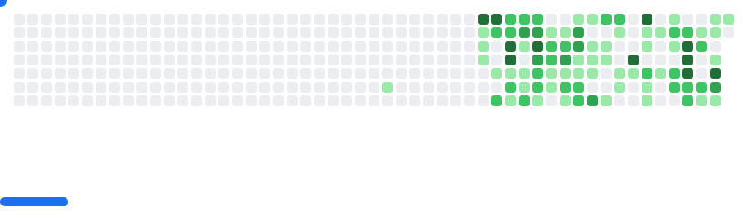

<!-- index.md -->

<!--

-->

<!--

You'd better show me your purpose first or I may ignore your important message.

-->
---

<!--

-->

<!---->

---

<picture>
  <source
    media="(prefers-color-scheme: dark)"
    srcset="./profile/breakout-dark.svg"
  />
  <!-- https://raw.githubusercontent.com/csy214-beep/csy214-beep/main/profile/breakout-dark.svg -->
  <source
    media="(prefers-color-scheme: light)"
    srcset="./profile/breakout-light.svg"
  />
  
</picture>

---
